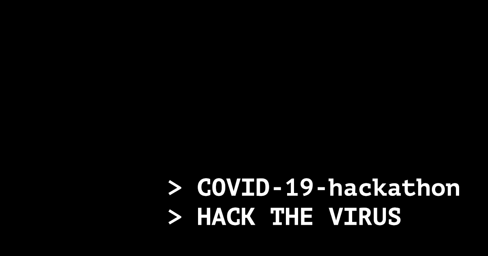

 

# Corona virus COVID-19 hackathon
Since we can't meet in person and we have a common enemy - coronavirus, I've come into an idea of creating the online hackathon. 
Right now I'm trying to gather as many people and ideas as possible, so if you want to support the idea of fighting the virus with software join our slack (link below). 

I believe that there are many things that we can do while we're sitting at our homes waiting for this pandemic to end. Let's #hackthevirus together!

## Slack
Join our slack: [COVID-19 hackathon](https://join.slack.com/t/2019-ncov-hackathon/shared_invite/zt-ckubrfcx-PeBk8OgQuhE7ihNP8omQCg)

## Rules
0. [#staythefuckhome](http://staythefuckhome.com)
1. Be nice
2. Be creative
3. Hack the virus!
4. There are no time limits 
5. Tag your repository with `hackthevirus` phrase

## Ideas
> [Post an idea](https://docs.google.com/forms/d/e/1FAIpQLSe8mM1ggHnRRXkcebGBpSal0brssQkfnH2TN4pdypS-YuaL3Q/viewform?usp=sf_link)

> [Browse posted ideas](https://docs.google.com/spreadsheets/d/13O3dfyvI2fd7xnFRjH3VIA1PDk36DLkdaHkoEAxFLJE/edit?usp=sharing)

## Projects

The list of projects goes here... (add a new issue with link to your repository)
